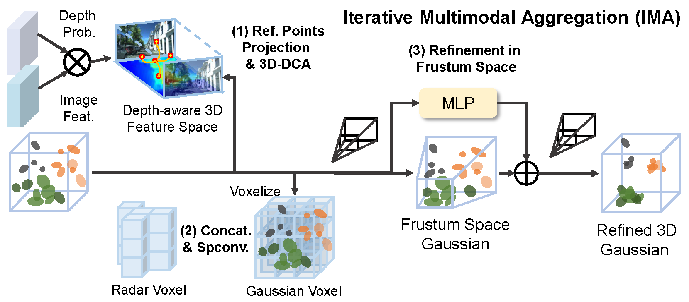
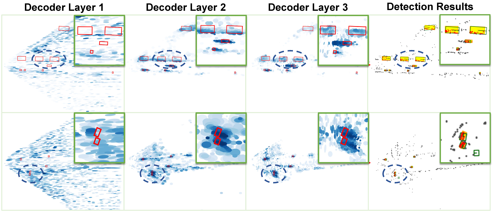
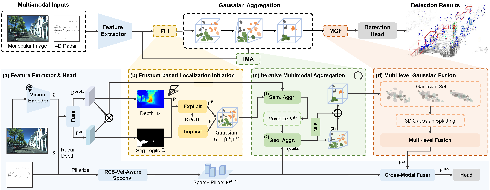
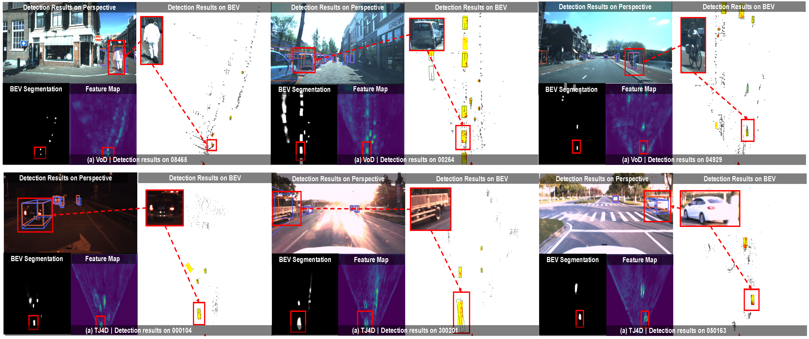

# RaGS: Semantics and Geometry Fusion for 3D Object Detection Using 4D Radar and Camera

## 🗓️ News

- **2025.xx.xx** all code will be released after acceptance.
- **2025.10.21** code v1.0 released

## 📜 Abstract
 
4D millimeter-wave radar has emerged as a promising sensor for autonomous driving, but effective 3D object detection from both 4D radar and monocular images remains a challenge. Existing fusion approaches typically rely on either instance-based proposals or dense BEV grids, which either lack holistic scene understanding or are limited by rigid grid structures. To address these, we propose RaGS, the first framework to leverage 3D Gaussian Splatting (GS) as representation for fusing 4D radar and monocular cues in 3D object detection. 3D GS naturally suits 3D object detection by modeling the scene as a field of Gaussians, dynamically allocating resources on foreground objects and providing a flexible, resource-efficient solution. RaGS uses a cascaded pipeline to construct and refine the Gaussian field. It starts with the Frustum-based Localization Initiation (FLI), which unprojects foreground pixels to initialize coarse 3D Gaussians positions. Then, the Iterative Multimodal Aggregation (IMA) fuses semantics and geometry, refining the limited Gaussians to the regions of interest. Finally, the Multi-level Gaussian Fusion (MGF) renders the Gaussians into multi-level BEV features for 3D object detection. By dynamically focusing on sparse objects within scenes, RaGS enable object concentrating while offering comprehensive scene perception. Extensive experiments on View-of-Delft, TJ4DRadSet, and OmniHD-Scenes benchmarks demonstrate its state-of-the-art performance. Code will be released.

  
  

 Procedure of Iterative Multimodal Aggregation (IMA), and Dynamic Object Attention of RaGS.

## 🛠️ Method

RaGS consists of a Feature Extractor \& Head, Frustum-based Localization Initiation (FLI), Iterative Multimodal Aggregation (IMA), and Multi-level Gaussian Fusion (MGF). The positions of the Gaussians are initialized using the FLI module, along with learnable attributes such as rotation, scale, opacity, and implicit feature embeddings. These Gaussians are then passed into the IMA module, where they are projected onto the image plane to gather semantic information. Next, they are processed as voxels using sparse convolution with height-extended radar geometry. Residuals relative to regions of interest are computed iteratively, updating the positions towards sparse objects. Finally, the multi-level Gaussians are rendered into Bird’s Eye View (BEV) features and fused through MGF, followed by cross-modal fusion for 3D object detection.

## 🔥 Getting Started

step 1. Refer to [Install.md](./docs/Guidance/Install.md) to install the environment.

step 2. Refer to [dataset.md](./docs/Guidance/dataset.md) to prepare View-of-delft (VoD) and TJ4DRadSet (TJ4D) datasets.

step 3. Refer to [train_and_eval.md](./docs/Guidance/train_and_eval.md) for training and evaluation.

### 😙 Acknowledgement

Many thanks to these exceptional open source projects:
- [BEVFormer](https://github.com/fundamentalvision/BEVFormer)
- [DFA3D](https://github.com/IDEA-Research/3D-deformable-attention.git)
- [mmdet3d](https://github.com/open-mmlab/mmdetection3d)
- [GaussianFormer](https://github.com/huang-yh/GaussianFormer)
- [SGDet3D](https://github.com/shawnnnkb/SGDet3D)
- [OmniHD-Scenes](https://github.com/TJRadarLab/OmniHD-Scenes)

As it is not possible to list all the projects of the reference papers. If you find we leave out your repo, please contact us and we'll update the lists.

## ✒️ Citation

If you find our work beneficial for your research, please consider citing our paper and give us a star. If you encounter any issues, please contact shawnnnkb@zju.edu.cn.

## 🐸 Visualization Results

Visualization results on the VoD validation set (first row) and TJ4DRadSet test set (second row) . Each figure corresponds to a frame. Orange and yellow boxes represent ground-truths in the perspective and bird’seye views, respectively. Green and blue boxes indicate predicted results. Zoom in for better view.
